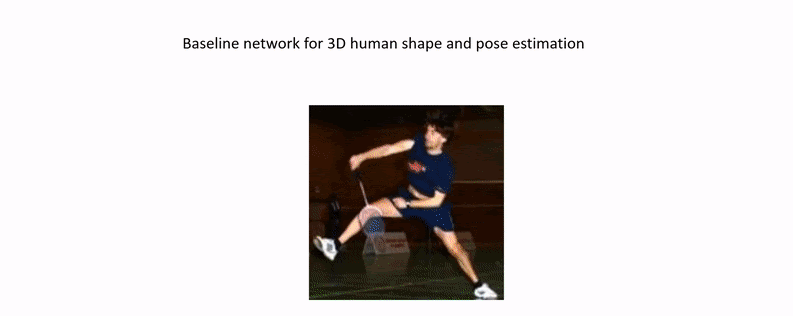

# RSC-Net: 3D Human Pose, Shape and Texture from Low-Resolution Images and Videos
Implementation for ["3D Human Pose, Shape and Texture from Low-Resolution Images and Videos", TPAMI 2021](https://arxiv.org/abs/2103.06498)

Conference version: ["3D Human Shape and Pose from a Single Low-Resolution Image with Self-Supervised Learning", ECCV 2020](https://arxiv.org/abs/2007.13666)

[Project page](https://sites.google.com/view/xiangyuxu/3d_eccv20)

## What is new?
* RSC-Net:
  + Resolution-aware structure
  + Self-supervised learning
  + Contrastive learning

* Temporal post-processing for video input
* TexGlo: Global module for 3D texture reconstruction

## Brief introduction


## Video
[](https://www.youtube.com/watch?v=OxFtRSlALIc)


## Code
### Packages
Make sure you have gcc==5.x.x for installing the packages. Then run:

```
bash install_environment.sh
```

If you are running the code without a screen, please install [OSMesa and the corresponding PyOpenGL](https://github.com/xuxy09/RSC-Net/blob/master/doc/pyrender_woscreen_install.md). Then uncomment the 2nd line of "utils/renderer.py".


### Data preparation
* Download [meta data](https://www.dropbox.com/s/jb3xudoef840nr7/data.zip?dl=0), and unzip it in "./data".

* Download [datasets](https://www.dropbox.com/s/wp5tkhahm19vo1i/datasets_pkl.zip?dl=0), and unzip it in "./datasets_pkl".

Note that all paths are set in "config.py".

### Demo
* Download [pretrained RSC-Net](https://www.dropbox.com/s/waa3r9tc0emepar/RSC-Net.pt?dl=0), and put it in "./pretrained".
* Run:
```
python demo.py --checkpoint=./pretrained/RSC-Net.pt --img_path=./examples/im1.png
```
* Note: if you have trouble in using Pyrender, please try "demo_nr.py":
```
python demo_nr.py --checkpoint=./pretrained/RSC-Net.pt --img_path=./examples/im1.png
```
If your neural-renderer has errors, please re-install the package from the [source](https://github.com/daniilidis-group/neural_renderer).

### Evaluation
```
python eval.py --checkpoint=./pretrained/RSC-Net.pt 
```

### Training
```
python train.py --name=RSC-Net 
```

&nbsp;
&nbsp;


If you find this work helpful in your research, please cite our paper:
```
@article{xu20213d,
title={3D Human Pose, Shape and Texture from Low-Resolution Images and Videos},
author={Xu, Xiangyu and Chen, Hao and Moreno-Noguer, Francesc and Jeni, Laszlo A and De la Torre, Fernando},
journal={TPAMI},
year={2021},
}

@inproceedings{xu20203d,
title={3D Human Shape and Pose from a Single Low-Resolution Image with Self-Supervised Learning},
author={Xu, Xiangyu and Chen, Hao and Moreno-Noguer, Francesc and Jeni, Laszlo A and De la Torre, Fernando},
booktitle={ECCV},
year={2020},
}
```


