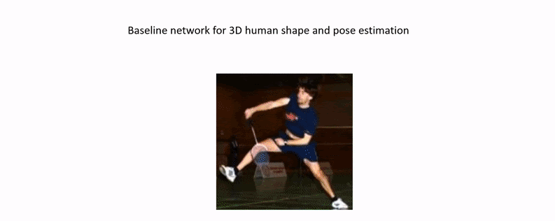

# RSC-Net: 3D Human Pose, Shape and Texture from Low-Resolution Images and Videos
Implementation for ["3D Human Pose, Shape and Texture from Low-Resolution Images and Videos", TPAMI 2021](https://arxiv.org/abs/2103.06498)

Conference version: ["3D Human Shape and Pose from a Single Low-Resolution Image with Self-Supervised Learning", ECCV 2020](https://arxiv.org/abs/2007.13666)

[Project page](https://sites.google.com/view/xiangyuxu/3d_eccv20)

## Abstract
* RSC-Net:
  + Resolution-aware structure
  + Self-supervised learning
  + Contrastive learning

* Temporal post-processing for video input
* TexGlo: Global module for 3D texture reconstruction

## Brief introduction


## Video
[](https://www.youtube.com/watch?v=OxFtRSlALIc)


## Code
Coming soon...

&nbsp;
&nbsp;


If you find this work helpful in your research, please cite our paper:
```
@article{xu20213d,
title={3D Human Pose, Shape and Texture from Low-Resolution Images and Videos},
author={Xu, Xiangyu and Chen, Hao and Moreno-Noguer, Francesc and Jeni, Laszlo A and De la Torre, Fernando},
journal={TPAMI},
year={2021},
}

@inproceedings{xu20203d,
title={3D Human Shape and Pose from a Single Low-Resolution Image with Self-Supervised Learning},
author={Xu, Xiangyu and Chen, Hao and Moreno-Noguer, Francesc and Jeni, Laszlo A and De la Torre, Fernando},
booktitle={ECCV},
year={2020},
}
```